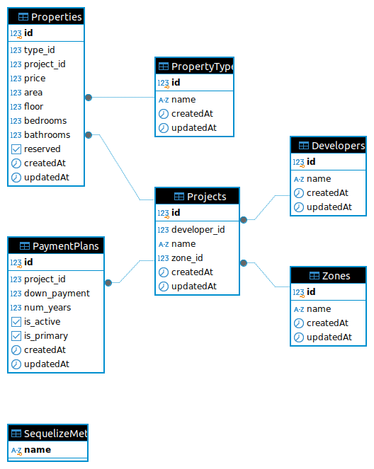

A NodeJS/ReactJS application for listing appartments

## Technologies used
- NodeJS/ExpressJS for backend development
- ReactJS for frontend development
- PostgreSQL for relational database

## Running the application with docker
### 1. Clone the repository and move to the root directory
```bash
git clone https://github.com/mariamelkhashab16/real-state-shares
cd real-state-shares
```
### 2. Run the docker container
```bash
docker-compose up
```
you may need super user privilege
```bash
sudo docker-compose up
```

## Features checklist:
- [x] listing appartments
- [x] getting appartment details
- [x] adding appartments
- [x] search for appartments by filters
- [x] pagination

## Future improvements
- [] Authentication and authorization for users
- [] Images for properties
- [] Activations between customer and his booked property
- [] Add more filtering functionalities (price, appartment type,...)



